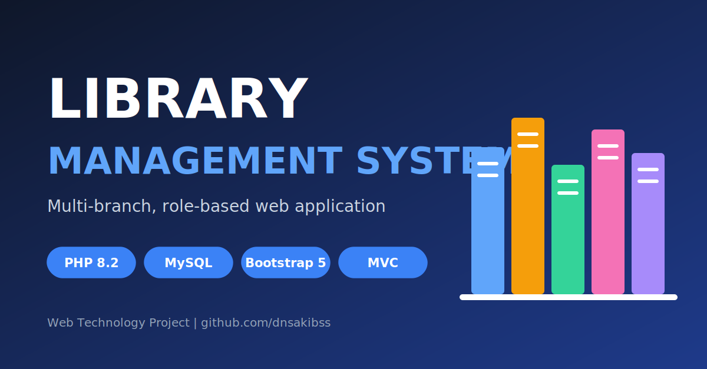
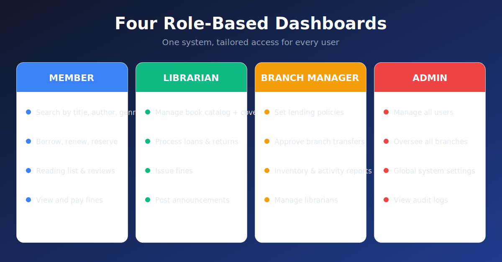
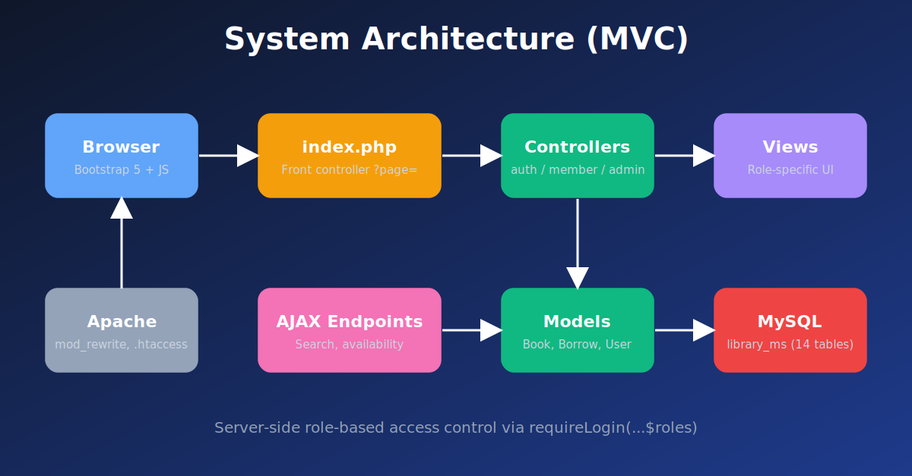
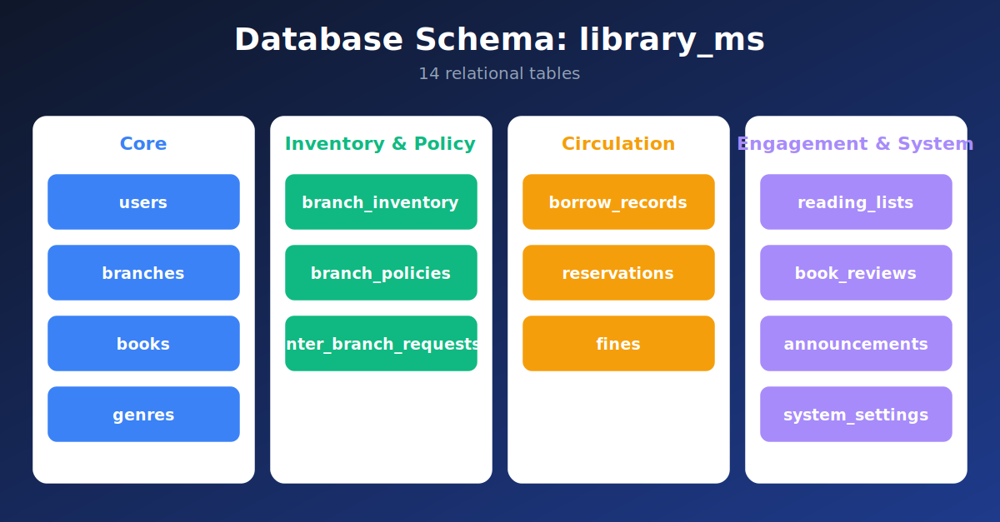

# 📚 Library Management System (LMS)



A web-based Library Management System built with PHP and MySQL. The application supports multi-branch library operations and provides role-specific dashboards for administrators, branch managers, librarians, and members.


---

## Overview

### User Roles



### System Architecture



### Database Schema



<!--
Add your real app screenshots here once they are in the screenshots/ folder,
then remove this comment wrapper.

## Screenshots

| Member Catalog | Librarian Panel |
|---|---|
|  |  |

| Branch Manager | Admin Dashboard |
|---|---|
|  |  |
-->

---

## Features

### Member
- Browse and search books by title, author, or genre
- View book details, availability, and cover images
- Submit borrow requests and track active loans
- Renew loans and manage reservations
- Maintain a personal reading list
- Leave book ratings and reviews
- View and pay outstanding fines
- Read branch announcements

### Librarian
- Add, edit, and manage the book catalog (with cover image uploads)
- Process borrow requests, returns, and renewals
- Manage genres and branch inventory
- Track active loans and member records
- Handle reservations and inter-branch transfers
- Issue and manage fines
- Post announcements

### Branch Manager
- Oversee branch operations and manage assigned librarians
- Configure per-branch lending policies (loan duration, max books, fines, renewals)
- View inventory, member, and activity reports
- Approve inter-branch transfer requests
- Access branch-level statistics

### Admin
- Manage all users across all branches and roles
- Oversee all branches and global system settings
- Full access to books, reports, announcements, and transfers
- View audit logs

---

## Tech Stack

| Layer | Technology |
|---|---|
| Backend | PHP 8.2 |
| Database | MySQL / MariaDB 10.4 |
| Frontend | Bootstrap 5.3, Bootstrap Icons |
| Architecture | MVC (Front Controller pattern via `index.php?page=`) |
| Server | Apache (with `.htaccess`) |
| DB Interface | MySQLi |

---

## Project Structure

```
lms/
├── index.php                  # Front controller — routes all ?page= requests
├── .htaccess
├── config/
│   ├── app.php                # App constants, session/auth helpers, flash messages
│   ├── db.php                 # MySQLi database connection
│   └── schema.sql             # Database schema
├── app/
│   ├── controller/
│   │   ├── auth/              # Login, logout, register, home
│   │   ├── member/            # Member-facing controllers
│   │   ├── librarian/         # Librarian-facing controllers
│   │   ├── branch_manager/    # Branch manager controllers
│   │   ├── admin/             # Admin controllers
│   │   └── ajax/              # AJAX endpoints (book search, availability, etc.)
│   ├── model/
│   │   ├── Models.php         # Core models (users, branches, fines, etc.)
│   │   ├── BookModel.php      # Book-related queries
│   │   ├── BorrowModel.php    # Borrow/return/renewal logic
│   │   └── UserModel.php      # User account queries
│   └── view/
│       ├── admin/
│       ├── branch_manager/
│       ├── librarian/
│       ├── member/
│       └── shared/            # header.php, footer.php, 404.php
├── public/
│   ├── css/style.css
│   ├── js/app.js
│   └── uploads/
│       ├── covers/            # Uploaded book cover images
│       └── profiles/          # User profile pictures
└── screenshots/               # README images
```

---

## Database Schema

The database is named `library_ms` and contains the following tables:

| Table | Description |
|---|---|
| `users` | All user accounts (admin, branch_manager, librarian, member) |
| `branches` | Library branch locations |
| `books` | Book catalog with metadata and cover image paths |
| `genres` | Book genre categories |
| `branch_inventory` | Per-branch stock of each book |
| `branch_policies` | Per-branch lending rules (loan days, max books, fines, renewals) |
| `borrow_records` | Active and historical loan records |
| `reservations` | Member book reservations |
| `reading_lists` | Personal reading lists per member |
| `fines` | Fine records linked to borrow records |
| `book_reviews` | Member ratings and reviews for books |
| `inter_branch_requests` | Requests to transfer books between branches |
| `announcements` | Branch or system-wide announcements |
| `system_settings` | Global configuration key-value store |

---

## Installation

### Requirements
- PHP 8.1+
- MySQL / MariaDB
- Apache with `mod_rewrite` enabled (or any web server supporting PHP)

### Steps

1. **Clone or extract** the project into your web server's root (e.g., `htdocs/lms` for XAMPP):
   ```bash
   git clone https://github.com/dnsakibss/LIBRARY-MANAGEMENT-SYSTEM-Web_Tech_Project.git lms
   ```
   ```
   htdocs/
   └── lms/
   ```

2. **Create the database** using the schema in `config/schema.sql`:
   ```bash
   mysql -u root -p -e "CREATE DATABASE IF NOT EXISTS library_ms"
   mysql -u root -p library_ms < config/schema.sql
   ```
   Or create a database named `library_ms` in phpMyAdmin and import `config/schema.sql` into it.

3. **Configure the database connection** in `config/db.php`:
   ```php
   define('DB_HOST', 'localhost');
   define('DB_USER', 'root');
   define('DB_PASS', '');
   define('DB_NAME', 'library_ms');
   ```

4. **Set the base URL** in `config/app.php` to match your local environment:
   ```php
   define('BASE_URL', 'http://localhost/lms/');
   ```

5. **Ensure the uploads directory is writable:**
   ```bash
   chmod -R 775 public/uploads/
   ```

6. **Open the app** in your browser:
   ```
   http://localhost/lms/
   ```

---

## Default Credentials

The database seed may include a default admin account. Check `config/schema.sql`, or create a user through the registration page and change their role in the `users` table.

---

## Default Lending Policy (System-wide)

These defaults apply when a branch has no custom policy set:

| Setting | Default |
|---|---|
| Fine rate | 5.00 / day |
| Max loan duration | 14 days |
| Max books borrowed | 5 |
| Max renewals | 2 |

Branch managers can override these per branch via the **Policies** panel.

---

## User Roles

| Role | Access Level |
|---|---|
| `member` | Self-service borrowing, reservations, fines |
| `librarian` | Book and loan management within a branch |
| `branch_manager` | Branch oversight, policies, reports |
| `admin` | Full system access |

Role-based access is enforced server-side via the `requireLogin(...$roles)` helper in `config/app.php`.

---

## License

This project is licensed under the [MIT License](LICENSE).
